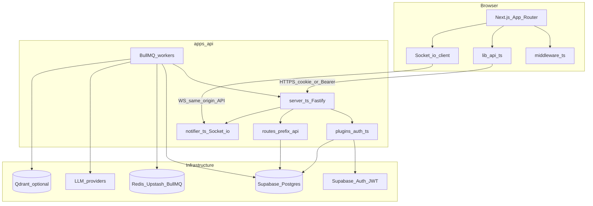
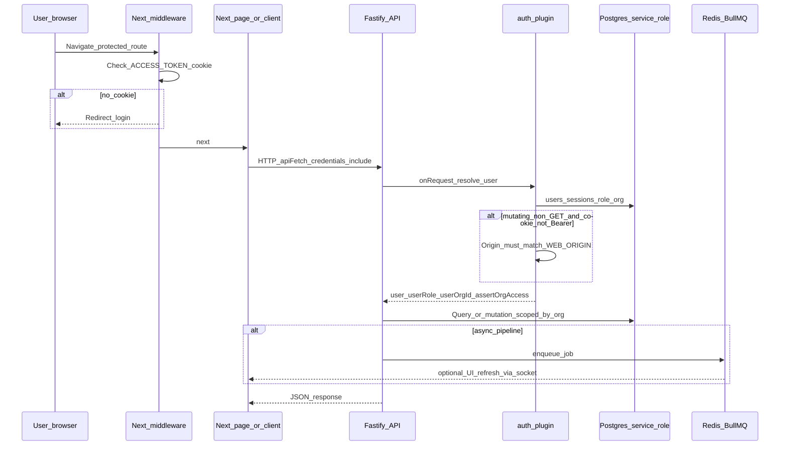
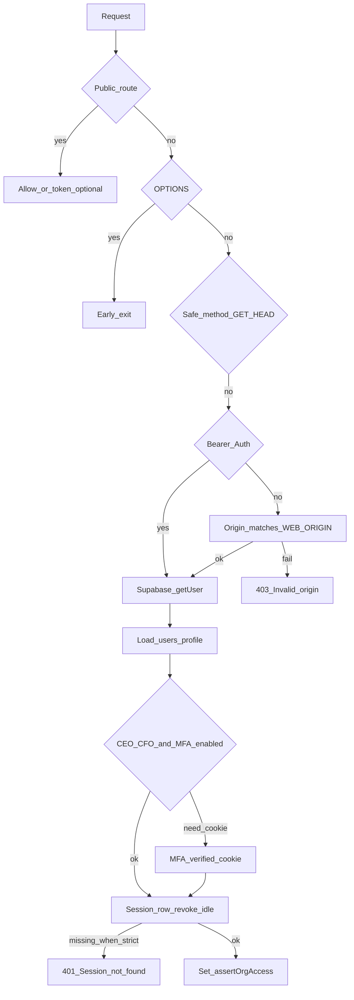
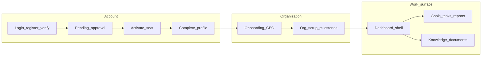
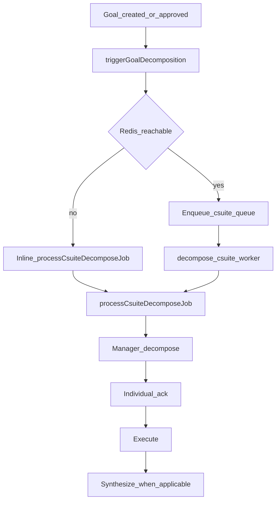
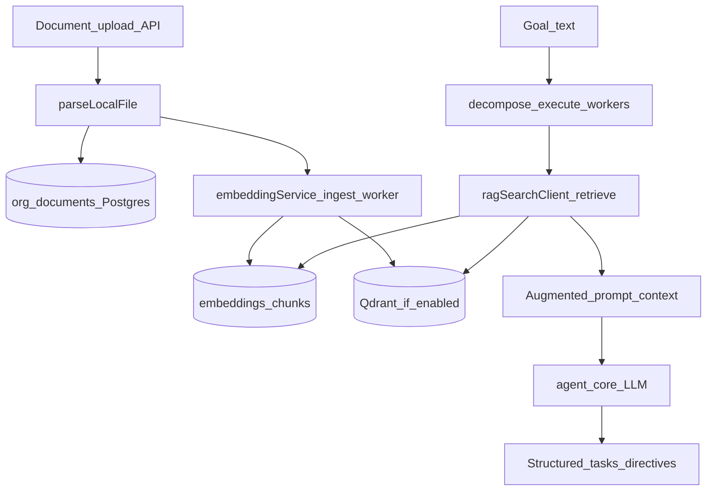
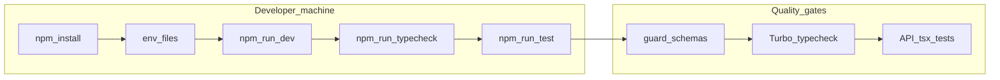

# ORGOS — application flow, data plane, UX, AI, and development

This document complements the repository [README](../README.md) with **end-to-end flows** and **Mermaid diagrams**. It reflects the current codebase layout (`apps/api`, `apps/web`, `packages/*`). Paths are relative to the repo root.

---

## 1. Monorepo and runtime boundaries

| Area | Responsibility |
|------|------------------|
| `apps/web` | Next.js 14 App Router, middleware cookie gate, `apiFetch` / forms to API with credentials, Socket.io client, React Query, Zustand |
| `apps/api` | Fastify HTTP API, auth plugin, route modules under `/api`, BullMQ workers, Socket.io on the same Node HTTP server |
| `packages/db` | SQL migrations (apply to Supabase Postgres); RLS may exist but **service-role** API access still requires app-layer `org_id` checks |
| `packages/shared-types` | Shared Zod schemas and types |
| `packages/agent-core` | LLM agents (CEO / manager / worker / synthesis), RAG message helpers, model routing (e.g. Groq + fallback) |

---

## 2. Data flow — browser to persistence

Typical **authenticated** interaction: UI calls REST, API validates token + session + org scope, then reads/writes Postgres via the Supabase **service** client. Long-running work is deferred to **workers** (when Redis is available) or run **inline** (see §5).

**Org isolation:** routes that accept an `org_id` (or derive it from entities) should call `request.assertOrgAccess(targetOrgId)` so a user cannot operate on another organization’s rows. Service-role bypasses RLS, so this check is part of the **data safety** model.

---

## 3. Authentication, session, and CSRF-style origin policy

Implemented in `apps/api/src/plugins/auth.ts`.

- **Token:** `Authorization: Bearer …` and/or `orgos_access_token` cookie.
- **Public routes:** login/register/MFA helpers, org search, health, and some recruitment apply URLs (see `PUBLIC_ROUTES` and `isDynamicPublicRoute`).
- **Non-public routes:** Supabase `getUser`, profile role + `org_id`, optional **MFA** gate for CEO/CFO when enabled.
- **Session row:** when **not** in relaxed local testing mode, a matching `sessions` row is **required**; missing or revoked/expired session → `401`.
- **Origin:** for mutating methods (`POST`, `PUT`, `PATCH`, `DELETE`) without `Bearer` auth, `Origin` must match `WEB_ORIGIN`. `OPTIONS` passes through for CORS preflight. Bearer API clients skip the origin check.

**Frontend gate:** `apps/web/middleware.ts` requires the access-token cookie for configured prefixes (`/dashboard`, `/settings`, `/org-setup`, `/onboarding`, etc.). This is **not** a substitute for API authorization; it only steers UX away from protected shells without a cookie.

---

## 4. User experience flow — primary journeys

| Stage | What the user sees | Backend / notes |
|-------|---------------------|-----------------|
| Login / register / verify | Auth pages | `/api/auth/*`, Supabase Auth |
| Pending | Waiting for admin approval | Profile `status`, `/api/me` |
| Activate seat | Token link from invite | `/api/auth/activate-seat` |
| Complete profile | Pick org, position, department | Profile updates, hierarchy scope for later RBAC |
| Onboarding (CEO path) | Company structure, positions import | `/api/onboarding/*` |
| Org setup | CEO completes gated milestones (e.g. positions, company docs) | `/api/orgs/:id/setup-milestone`, `org_setup` summary from `/api/me` |
| Dashboard | Role-based nav, realtime refresh | `DashboardShell`, `connectSocket` for WS |
| Goals / tasks | Create goals, watch decomposition, manage execution | Goals + tasks APIs, sockets (`goal:decomposed`, `goal:progress`, task events) |

**Goal proposals (escalation):** managers (and other roles per route rules) can submit proposals; executives approve → creates a goal and triggers decomposition (`apps/api/src/routes/goalProposals.ts`, `apps/api/src/services/orgGraph.ts`).

---

## 5. Goal lifecycle — queue vs inline decomposition

Entry: creating or approving a goal leads to `triggerGoalDecomposition` (`apps/api/src/services/goalDecomposition.ts`).

- **Queued path:** BullMQ job → `decompose.csuite.worker` → downstream queues/workers as designed.
- **Inline path (no Redis):** same processor functions are invoked **in-process** with real `enqueueIndividualAck` / `enqueueExecute` callbacks wired to `processIndividualAckJob` and `processExecuteJob`, so task side-effects stay on one logical pipeline.

---

## 6. AI and RAG flow — from documents to agents

**Ingestion (knowledge):**

1. CEO (or allowed role) uploads documents → `POST /api/documents/upload` (`apps/api/src/routes/documents.ts`).
2. File parsed locally → text normalized → optional embedding plan (vector / hybrid / vectorless).
3. Rows stored in Postgres; optional Qdrant upsert via embedding worker path when configured.

**Retrieval (agents):**

- Workers call `ragSearchClient` / retrieval helpers (`apps/api/src/services/ragSearchClient.ts`, `ragRetrieval.ts`, `qdrantVectorStore.ts`) — **not** a separate public HTTP “search” route.
- CEO decomposition may run **dual retrieval** (goal text + policy-augmented query), merge/dedupe, optional keyword rerank (`packages/agent-core` hierarchical agent path).

**Optional env:** `ORGOS_CEO_DECOMPOSE_SINGLE_CALL` toggles an experimental single-call CEO path vs hierarchical decomposition (`apps/api/src/config/env.ts`, csuite worker).

---

## 7. Realtime — Socket.io

`apps/api/src/services/notifier.ts` attaches Socket.io to the Fastify HTTP server. Clients authenticate with the same token (cookie or handshake `auth`). Server joins sockets to rooms such as `user:{id}`, `org:{orgId}`, `org:{orgId}:role:{role}`.

**Examples:**

- Task lifecycle events → task invalidation in the web layer (`apps/web/lib/socket.ts`, `useRealtimeQueryInvalidation`).
- `goal:decomposed` → CEO/CFO role rooms (see `emitGoalDecomposed`).
- `goal:progress` → org room via `emitGoalProgress` for broad UI refresh.

The dashboard shell connects the shared socket when entering `/dashboard` so pages like Goals receive events without opening the task board first.

---

## 8. Development and operations flow

| Command | Purpose |
|---------|---------|
| `npm run dev` | Starts local Redis helper, API (`apps/api`), and web (`apps/web`) — see root `package.json` |
| `npm run typecheck` | Turborepo TypeScript across workspaces |
| `npm run test` | Schema guard + `apps/api` Node test suite (`tsx --test test/**/*.test.ts`) |
| `npm run build` | Production builds via Turborepo |
| `npm run db:apply-remote` / `db:apply-remote-direct` | Apply `packages/db/schema/*.sql` to linked Supabase |

**Environment:** copy `.env.example` patterns into `apps/api` and `apps/web` env files; set `WEB_ORIGIN`, `NEXT_PUBLIC_API_URL`, Supabase keys, Redis URL, and LLM keys as required for the features you exercise.

**Applying new migrations:** after pulling SQL under `packages/db/schema/`, run your chosen apply script against the target database before relying on new columns (for example org setup flags or `goal_proposals`).

---

## 9. Quick reference — mounted API modules

Registered under `/api` in `apps/api/src/server.ts`:

`auth`, `expansion`, `org`, `me`, `goals`, `tasks`, `reports`, `recruitment`, `settings`, `onboarding`, `documents`, `help`, `goal-proposals` (plugin path prefixes vary; see each route file).

Unprefixed: `health`, `metrics`.

---

## 10. Diagram index

| Diagram | Section |
|---------|---------|
| Monorepo / infra | §1 |
| Request + DB sequence | §2 |
| Auth / session / origin | §3 |
| UX stages | §4 |
| Goal decomposition | §5 |
| RAG + agents | §6 |
| Dev workflow | §8 |

For deployment-specific notes, see [PLATFORM_DEPLOY.md](PLATFORM_DEPLOY.md) if present in your checkout.
